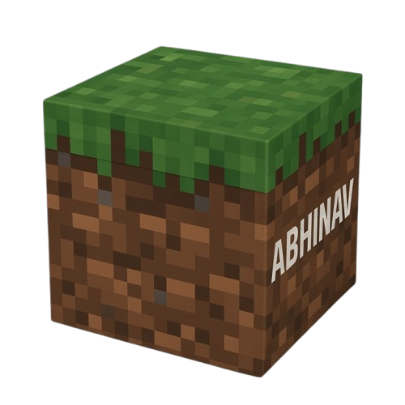

<!-- <div align="center">



<br/>


<div align="center">


<!--  -->
<div align="center">


<br/>

<h1 align="center">Hi, I'm Abhinav! 👋</h1>
<h3 align="center">3<sup>rd</sup> Yr UnderGrad | Full-Stack & AI/ML Enthusiast</h3>

<br/>


<br/>


<br/>

[](https://abhinavphi.vercel.app)
[](https://linkedin.com/in/abhinavphi)
[](mailto:abhinav.phi15@gmail.com)
[](https://github.com/abhinav-phi)

<br/>


</div>

<br/>

---

<br/>

## About Me

I'm a Computer Science undergraduate at **NSUT, Delhi** (Class of 2028), heading into my third year with a strong focus on **full-stack engineering**, **systems thinking**, and **applied machine learning**. I like owning products end-to-end — from designing APIs and data models to shipping production-grade, scalable interfaces.

- Comfortable across the stack: **React / TypeScript** on the frontend, **FastAPI / Go / Node.js** on the backend, and **PostgreSQL / MySQL / MongoDB** for data
- Strong interest in **applied ML** — gradient-boosted ensembles, model interpretability (SHAP), and production ML pipelines
- Product-engineering mindset — took a platform from staging to production solo, with security, SEO, CI/CD, and monitoring (99%+ uptime)
- Currently sharpening system design fundamentals and cloud basics ahead of internship season

<br/>

<div align="center">

### Open To


</div>

<br/>

---

<br/>

## Tech Stack

<div align="center">

**Languages**


**Frontend**


**Backend & Databases**


**Cloud, DevOps & Tooling**


</div>
<br/>

---

<br/>

## AI / ML Expertise

| Domain | Proficiency | Details |
|---|:---:|---|
| **Supervised Learning** | High | Gradient-boosted ensembles (XGBoost, LightGBM) for multi-class classification on large-scale tabular data (2.8M+ network flow records) |
| **Model Explainability** | High | SHAP-based feature attribution integrated into live inference pipelines for per-prediction interpretability |
| **Data Engineering** | Intermediate | Flow-feature extraction pipelines (Scapy), preprocessing, and class-imbalance handling with `imbalanced-learn` |
| **ML Systems / Serving** | Intermediate | Real-time model serving via FastAPI + WebSockets, containerized with Docker Compose |
| **Deep Learning Fundamentals** | Foundational | PyTorch / TensorFlow basics — actively deepening as part of placement prep |

<br/>

---

<br/>

## Coding Profiles

<div align="center">

[](https://leetcode.com/)
[](https://codeforces.com/)
[](https://www.codechef.com/)
[](https://www.geeksforgeeks.org/)

</div>

<br/>

---

<br/>

## GitHub Analytics

<div align="center">


</div>

<br/>

---

<br/> 

## Contribution Activity

<div align="center">


</div>

<br/>

---

<br/>

## Contribution Snake

<div align="center">

<picture>
  <source media="(prefers-color-scheme: dark)" srcset="https://raw.githubusercontent.com/abhinav-phi/abhinav-phi/output/github-contribution-grid-snake-dark.svg" />
  <source media="(prefers-color-scheme: light)" srcset="https://raw.githubusercontent.com/abhinav-phi/abhinav-phi/output/github-contribution-grid-snake.svg" />
  
</picture>

</div>

<br/>

---

<br/>

## Current Focus

```yaml
current_focus:
  learning:
    - System Design (HLD/LLD fundamentals)
    - Advanced SQL & Database Internals
    - Cloud Fundamentals (AWS / GCP basics)
    - Redis & Caching Strategies

  building:
    - The Sentinel — ML-based NIDS with real-time explainability
    - Personal portfolio & dev-tooling side projects

  exploring:
    - LLM-powered developer tools & agentic workflows
    - Distributed systems & scalable backend architecture

  open_to:
    - SDE Internships — Backend / Full-Stack / ML (Summer 2026)
    - Remote / Delhi NCR / Hybrid roles
    - Open-source collaboration on dev tools & ML systems
```

<br/>

---

<br/>

## Connect With Me

<div align="center">

[](mailto:abhinav.phi15@gmail.com)
[](https://linkedin.com/in/abhinavphi)
[](https://github.com/abhinav-phi)
[](https://abhinavphi.vercel.app)

</div>

<br/>

---

<br/>

<div align="center">

*"Code is the closest thing we have to magic — write it deliberately."*


</div>
