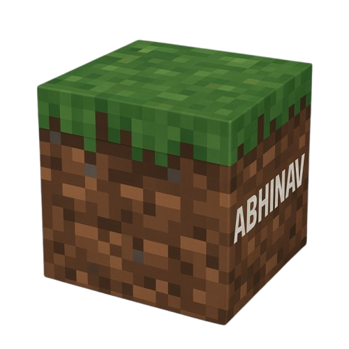
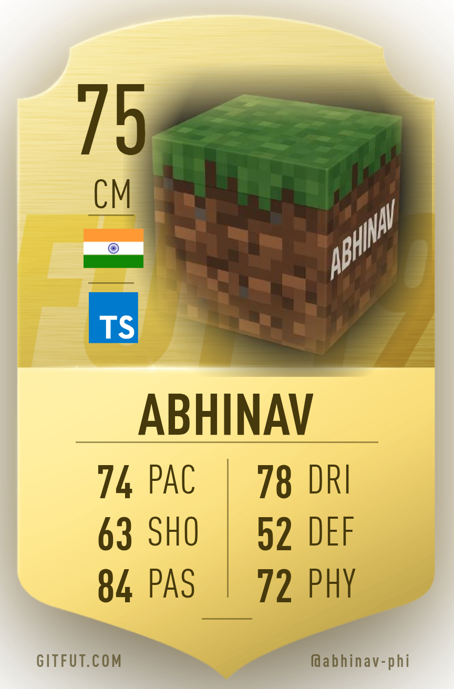

 

<h1 align="center">Hi, I'm Abhinav! 👋</h1>
<h3 align="center">3rd yr UnderGrad | Full-Stack & AI/ML Enthusiast</h3>

 

## GitHub Analytics

<table>
  <tr>
    <td width="58%" valign="top">
      
       
      
    </td>
    <td width="42%" valign="middle">
      
    </td>
  </tr>
</table>

## Tech Stack

**Languages**

**Frontend**

**Backend & Databases**

**ML & DevOps**

 

<picture>
  <source media="(prefers-color-scheme: dark)" srcset="https://raw.githubusercontent.com/abhinav-phi/abhinav-phi/output/github-contribution-grid-snake-dark.svg" />
  <source media="(prefers-color-scheme: light)" srcset="https://raw.githubusercontent.com/abhinav-phi/abhinav-phi/output/github-contribution-grid-snake.svg" />
  
</picture>

